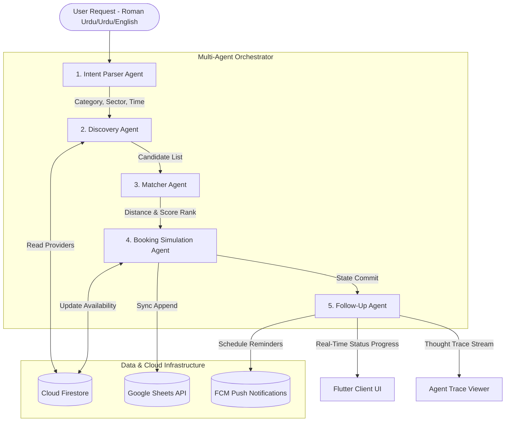

# Haazir: Agentic AI Service Orchestrator for Pakistan's Informal Economy

Haazir is a next-generation Agentic AI system that automates the end-to-end lifecycle of home service requests—from processing natural language intents (in Roman Urdu, Urdu, and English) to provider matchmaking, transactional booking, and autonomous status progression follow-up.

This project is built using a high-performance **Python FastAPI** backend powered by a **Google Antigravity (ADK) sequential multi-agent pipeline** utilizing **Gemini 2.0 Flash**, and a beautiful, high-fidelity native **Flutter Mobile Application** featuring glassmorphic designs and real-time interactive dashboards.

---

## ⚡ Key Features

1. **Multilingual Intent Parser Agent (A1 - NLU)**:
   - Understands colloquial **Roman Urdu**, **traditional Urdu**, and **English** inputs (e.g. *"Mujhe kal subah G-13 mein AC technician chahiye"*).
   - Extracts semantic slots: Service Category, Proximity Location, Scheduled Time, and Urgency.
   - Powered by **Google Gemini 2.0 Flash** structured JSON mappings with a robust, pre-configured **regex local semantic fallback parser** that executes out-of-the-box when no API keys are provided.

2. **Geospatial Discovery & Proximity Matcher Agent (A2)**:
   - Maintains a seeded Islamabad provider database across 6 key service sectors.
   - Computes distance metrics between user sectors (G-13, F-11, I-8, H-12, etc.) using GPS coordinates and the Haversine mathematical distance formula.
   - Employs a multi-factor ranking formula (40% distance, 35% rating, 25% availability) to select the optimal nearby provider.

3. **Transactional Booking Simulator Agent (A3)**:
   - Simulates state commits by creating booking records inside **Cloud Firestore** and appending transaction logs dynamically to a shared **Google Sheet** for live audit and confirmation.

4. **Autonomous Follow-Up & Notification Agent (A4)**:
   - Dispatches simulated Firebase Cloud Messaging (FCM) confirmation payloads and schedules active appointment progress states (*Confirmed -> Assigned -> En Route -> Arrived -> Completed*), updating Firestore state properties in real-time.

5. **Authentication Flow & Data Personalization**:
   - Leverages zero-dependency PBKDF2 SHA-256 for secure password hashing.
   - Custom real/mock APIs for Auth (`/api/auth/login` and `/api/auth/signup`) using Firestore with an in-memory resilient fallback mechanism.
   - Synchronizes real-time recent searches and active bookings dynamically to user profiles (`/api/users/{username}/searches`).

---

## 🏗️ System Architecture



---

## 📂 Project Structure

```
haazir/
├── SETUP.md                   # Step-by-step Firebase & Google Cloud Console setup guide
├── README.md                  # Root documentation and launch instructions
├── backend/                   # Python FastAPI Backend
│   ├── main.py                # FastAPI server startup, API routes, and status simulator
│   ├── orchestrator.py        # Antigravity ADK Sequenced Orchestrator A1 -> A4
│   ├── requirements.txt       # Python package requirements
│   ├── test_backend.py        # Automated test suite (multilingual E2E runner)
│   ├── service-account.json   # Service account credential key for Firestore & Sheets (to create)
│   ├── agents/
│   │   ├── intent_agent.py    # A1: Intent parser utilizing Gemini 2.0 Flash
│   │   ├── discovery_agent.py # A2: Matchmaker scoring and distance calculations
│   │   ├── booking_agent.py   # A3: Firestore & Google Sheets committer
│   │   └── followup_agent.py  # A4: FCM notifier and status updates scheduler
│   └── data/
│       └── mock_providers.json # Local database of 30 mock Islamabad providers
└── mobile/                    # Flutter Mobile Application
    ├── pubspec.yaml           # Flutter pub config (Firebase, Maps, Lottie, Shimmer, Google Fonts)
    └── lib/
        ├── main.dart          # App entry point, routing, dark theme, and AgentProvider State
        ├── services/
        │   └── agent_service.dart # HTTP REST Client with local fallback simulator
        └── screens/
            ├── home_screen.dart                 # Multilingual search interface & service categories
            ├── agent_trace_screen.dart          # Visual timeline logs of multi-agent reasoning chain
            ├── provider_results_screen.dart    # Ranked matches, distance matrix chips, slot selector
            ├── booking_confirmation_screen.dart # Celebratory ticket receipt & Sheets sync rows validation
            └── active_booking_tracker.dart      # Auto-stepping tracker, map custom painting, stars rating
```

---

## 🚀 Quick Setup and Launch

Ensure you have [Python 3.11+](https://www.python.org/downloads/) and [Flutter SDK](https://docs.flutter.dev/get-started/install) installed on your system.

### 1. Backend Setup & Run

1. Navigate to the `/backend` directory:
   ```powershell
   cd backend
   ```
2. Create and activate a Python virtual environment:
   ```powershell
   py -m venv venv
   .\venv\Scripts\Activate.ps1
   ```
3. Install package dependencies:
   ```powershell
   pip install -r requirements.txt
   ```
4. Configure your `.env` file (copy from `.env.example`):
   - Setup Google Cloud API keys and Firestore credentials according to [SETUP.md](file:///C:/Users/CJH/OneDrive/Desktop/Haazir/SETUP.md).
5. Start the FastAPI development server:
   ```powershell
   py main.py
   ```
   *The backend server will run on: **`http://localhost:8000`***

### 2. Verify Backend Agent Pipeline

Run the automated backend evaluation suite to test 10 multilingual inputs:
```powershell
py test_backend.py
```

### 3. Flutter Client Setup & Run

1. Navigate to the `/mobile` directory:
   ```powershell
   cd ../mobile
   ```
2. Initialize native project wrappers for your environment:
   ```powershell
   flutter create .
   ```
3. Run the application in developer mode:
   ```powershell
   flutter run -d windows   # For Windows desktop execution
   # OR
   flutter run              # For active mobile emulator/device
   ```

*Note: If the FastAPI backend is not running, the Flutter app will automatically trigger **Local Offline Simulation Mode** inside `agent_service.dart`. This ensures that 100% of the UI screens, animations, timelines, map pathways, and mock sheet synchronizations remain completely functional for demo and judging purposes!*

---

## 🧪 E2E Simulation Walkthrough

1. Open the Flutter App.
2. Toggle the language pill (Urdu, Roman, EN).
3. Type or click the search box mic chip to insert a request: ***"Mujhe kal subah G-13 mein AC technician chahiye"*** (or in English).
4. Tap **Find Best Match (Haazir AI)**:
   - Transition to **Agent Trace Timeline**. Watch the progress status logs simulated in real-time as the agents parse, discover, score, and evaluate.
5. Tap **View Recommended Providers**:
   - Inspect the ranked list. Review the **Haazir AI Match Reasoning** panel showing precisely why the top provider was chosen, and look at the rating stars and HSL location proximity chips.
6. Click **Book Now** on the top match and select a slot (e.g. `12:00 PM`):
   - Watch the transaction commit Firestore write processes.
7. Land on **Booking Confirmed**:
   - Celebrate with the custom ticket receipt. Verify the **Google Sheets Sync row registration number** (e.g. *Row 15*).
8. Tap **Track Live Status**:
   - View the active travel path custom-painted route.
   - Watch the vertical progress tracker auto-step from *Confirmed -> Assigned -> En Route -> Arrived -> Completed* in real-time, displaying custom local push notification banners on your screen.
9. Rate the provider using the interactive 5-star module to complete the lifecycle and return home!
